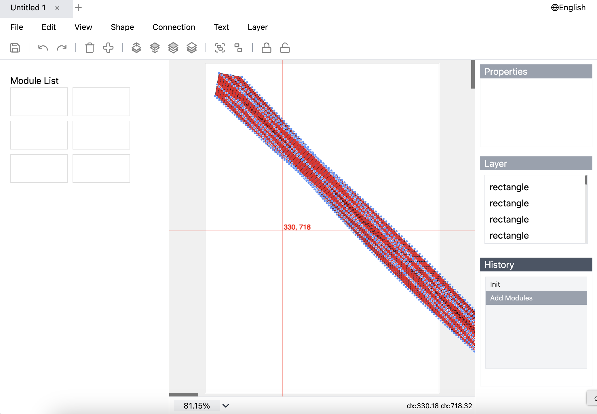

# Vision flow

Try it 
```bash
git clone https://github.com/17x/vision-flow.git --depth=1
```

```bash
cd vision-flow
npm install && npm run dev
```


### See it
https://lucasischow.github.io/demos/vision-flow/

### Ongoing ......




Todo List
- zooming
  - on specific position

[//]: # (- LayerPanel - buffer rendering and drag to reorder)
- modules - Layer indexes
  - lock and unlock
  - group and ungroup
  - folder management
- Interface: light theme, dark theme, preferences
- 
